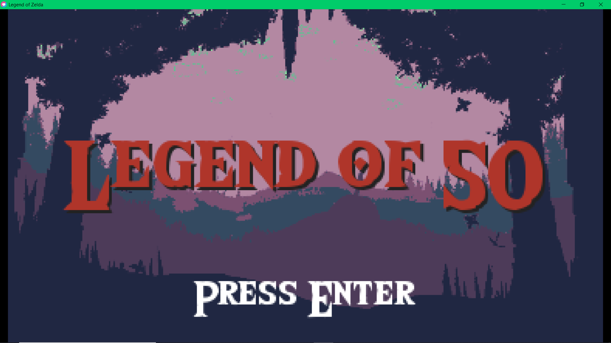
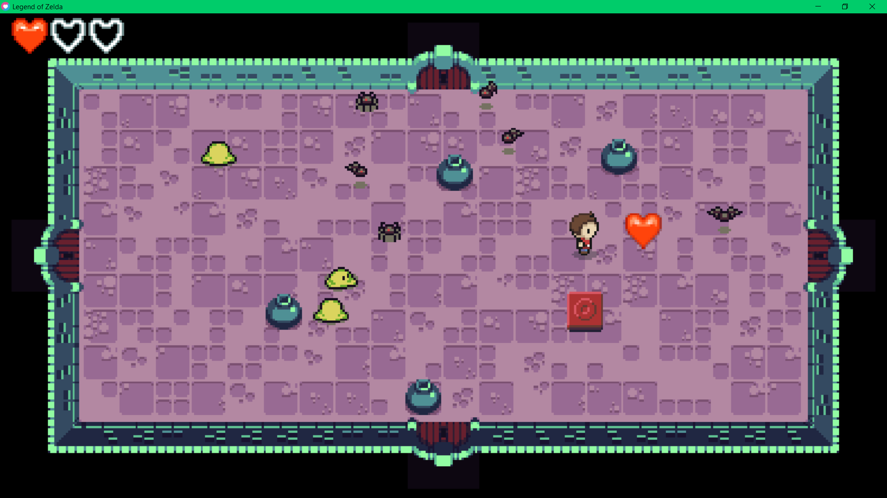
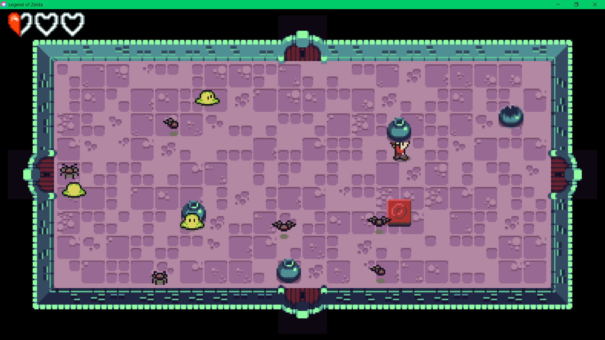
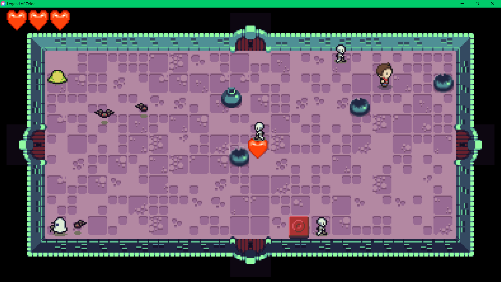
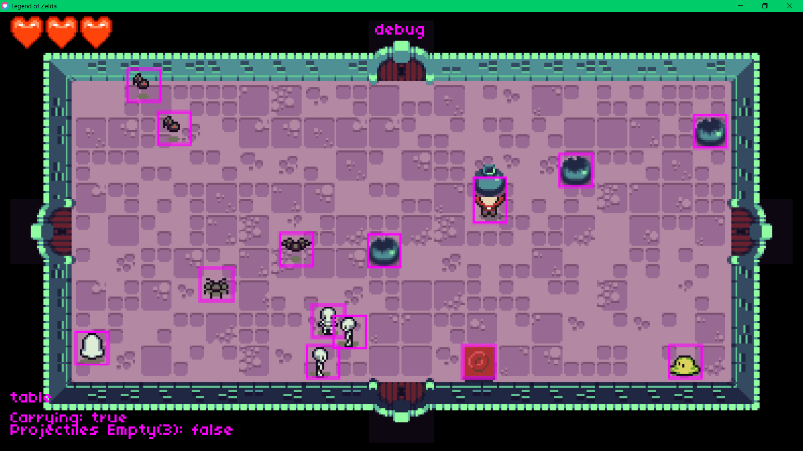

# Zelda Lite Assignment

## Description
The task of the assignment was to add random generation of cermaic pots, that are able to be picked up, thrown and shatter upon impact on gameobjects. These thrown pots should
have the ability to damage and defeat enemies in the game. Another task apart of the assignment was letting defeated enemies drop hearts for the user to heal from. The game is a dungeon crawling game where each room is procedurally generated, putting random amount of enemies and cermaic pots where the player has to trigger a floor button to open the doors to proceed to the next dungeon room.

### Challenges Faced
- Creating new different game object types to work withs the existing code
- Creating a gamestate for creating the ability to throw the object towards things
- Focusing on data driven design, as a result getting the correct animations to play in the correct direction the player is facing

### Screenshots

- After killing a character there is a chance that a heart will spawn, healing the player one heart.
- 

- When you press enter to pickup a pot, it changes the character state preventing them from swing sword. But it will let you throw pots in your hand

- After pots collide with game object they will break preventing the player from picking up the pot again
- Throwing pots and when they collide with enemies killing them
- After a certain distance the pot will "fall" to the ground and break
- The pot will break when colliding with the wall of the dungeon

- Although the assignment came with the ability to debug, by letting hitboxes render they did not provide a debug mode.
- Created a debug mode, with additional hitboxes (eg.Pickup pot hitbox) or other player stats.

### Credit
This project was created following the Havard cs50 Game Design course. Here is a [link](https://youtu.be/GfwpRU0cT10) to their first lecture where more information could be found.
